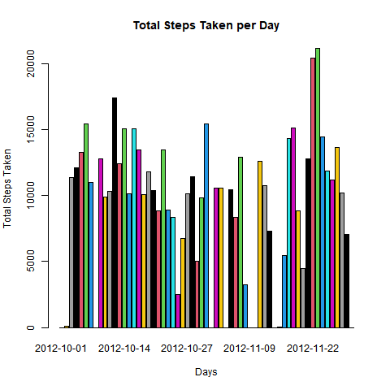
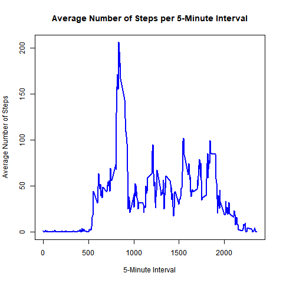
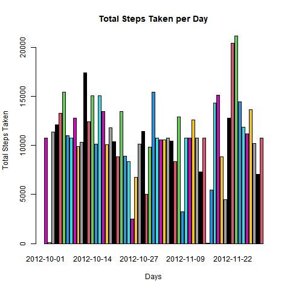
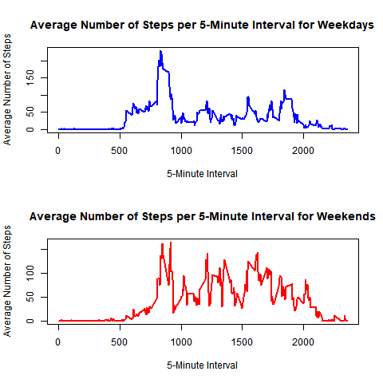

## Loading and Preprocessing the Data

``` r
dat = read.csv("activity.csv")
dat$date = as.Date(dat$date, format = "%Y-%m-%d")
```

## What is mean total number of steps taken per day?



    ## [1] "Mean of steps across all days:"

    ## [1] 9354.23

    ## [1] "Median of steps across all days:"

    ## [1] 10395

## What is the average daily activity pattern?



## Imputing Missing values



    ## [1] "Mean of steps across all days:"

    ## [1] 10766.19

    ## [1] "Median of steps across all days:"

    ## [1] 10766.19

## Are there differences in activity patterns between weekdays and weekends?



    ## [1] "Mean for weekdays:"

    ## [1] 35.61058

    ## [1] "Mean for weekends:"

    ## [1] 42.3664
